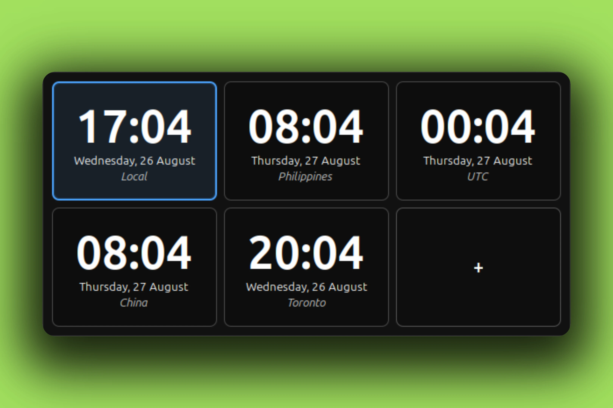
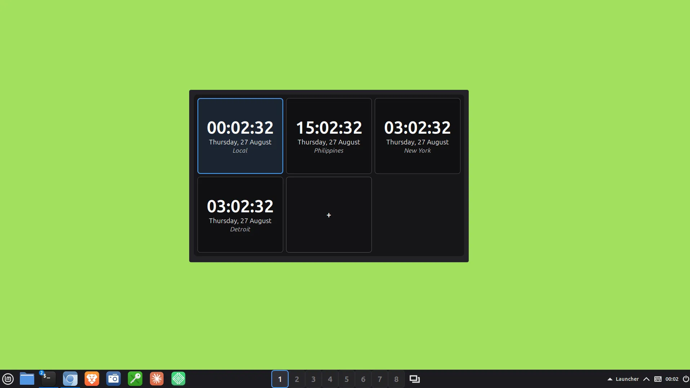
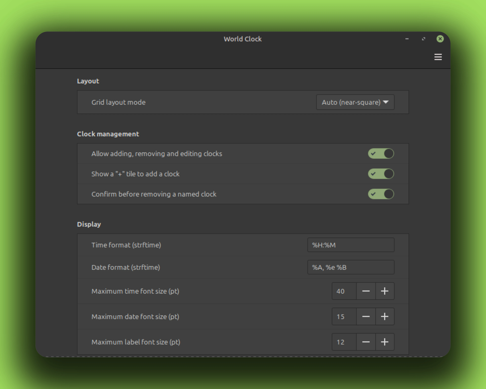

# World Clock

A Cinnamon desklet that shows a grid of clocks, each with its own name and timezone.

Left-click does nothing. Click the trailing **+** tile to add a clock. Right-click a tile to edit or remove it. Clocks set to the system timezone (`local`) are outlined.



On the desktop:



The settings window:



## Why this exists

Good world clock apps are hard to find. On any OS. The good ones live on your phone, or they bury the feature under menus, or they insist on taking over your system timezone.

I wanted the opposite. A glance at my desktop to see what time it is where my colleagues and partners are, all over the world, without touching my own clock. A grid of clocks, one per timezone, always visible. Nothing more.

That's what this desklet is.

## Features

- Auto (near-square) or fixed rows × columns
- Searchable timezone list (IANA zones plus Local)
- Shared time/date formats; font sizes are maximums and each tile scales down to fit
- Last clock cannot be removed
- Optional confirmation before removing a named clock
- Layout, spacing, and size are configured from Cinnamon Desklet settings

## Configuration

Right-click the desklet to **Configure…**

- **Grid layout mode**: auto or fixed rows/columns
- **Allow adding, removing and editing clocks**: turn off for a read-only grid
- **Show a "+" tile**: hide the add tile while keeping the right-click menu
- **Time / date format**: `strftime` patterns (for example `%H:%M` or `%I:%M %p`)
- **Maximum font sizes**: time, date, and label; tiles shrink so nothing overflows
- **Tile spacing** and **desklet width / height**

## Manual install

No root needed. Everything installs into your home directory.

From a release package:

```bash
curl -fLO https://github.com/RobertAlexanderH/cinnamon-world-clock-desklet/releases/latest/download/cinnamon-world-clock-desklet.zip
unzip cinnamon-world-clock-desklet.zip
rm -rf ~/.local/share/cinnamon/desklets/cinnamon-world-clock-desklet@curbsoftware
cp -r cinnamon-world-clock-desklet@curbsoftware/files/cinnamon-world-clock-desklet@curbsoftware \
   ~/.local/share/cinnamon/desklets/cinnamon-world-clock-desklet@curbsoftware
```

Or straight from git:

```bash
git clone https://github.com/RobertAlexanderH/cinnamon-world-clock-desklet.git
cd cinnamon-world-clock-desklet
rm -rf ~/.local/share/cinnamon/desklets/cinnamon-world-clock-desklet@curbsoftware
cp -r files/cinnamon-world-clock-desklet@curbsoftware \
   ~/.local/share/cinnamon/desklets/cinnamon-world-clock-desklet@curbsoftware
```

The `rm -rf` before the copy is the upgrade path: old files are removed so
nothing deleted upstream lingers, then the copy brings the new tree in. Your
settings are stored separately in `~/.config/cinnamon/spices/cinnamon-world-clock-desklet@curbsoftware/`
and survive reinstalls.

Restart Cinnamon (**Alt-F2**, type `r`, Enter) and add the desklet from
Cinnamon Settings.

## Notes

This is a desktop **desklet**, not the panel [World Clock Calendar](https://cinnamon-spices.linuxmint.com/applets/view/108) applet. It can run next to that applet; they do not share settings.

UUID: `cinnamon-world-clock-desklet@curbsoftware`

Derived from [TimeAndDate@nightflame](https://cinnamon-spices.linuxmint.com/desklets/view/9).

## License

GNU General Public License v2.0 or later. See [LICENSE](LICENSE).
